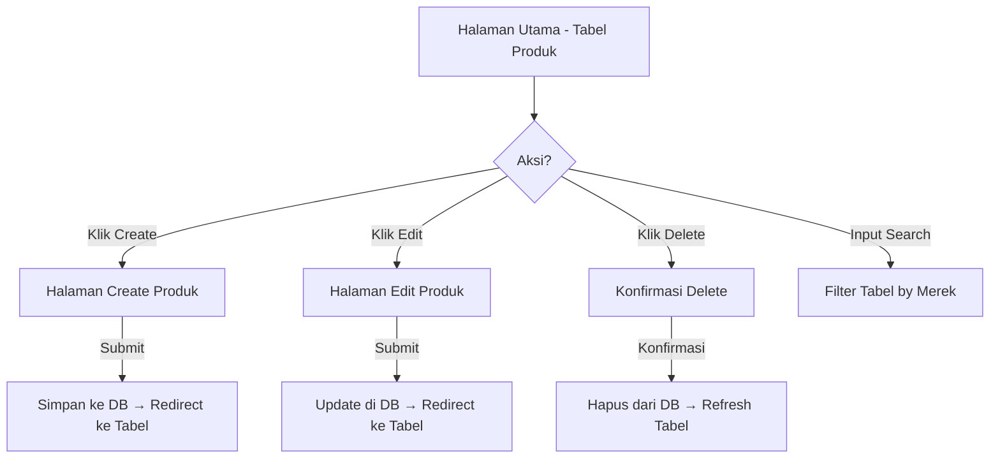

# Product Requirements Document (PRD)
# Vehicle Inventory — Sistem Manajemen Inventaris Kendaraan Bekas

## 1. Ringkasan Produk

**Nama Produk:** Vehicle Inventory Management System  
**Versi:** 1.0  
**Tanggal:** 13 Maret 2026  
**Stakeholder:** Vehicle Inventory (Perusahaan Otomotif Kendaraan Bekas)

Vehicle Inventory adalah perusahaan otomotif yang menjual kendaraan bekas pakai dengan berbagai merek seperti **Toyota, Daihatsu**, dan tipe mobil yang bervariasi — mulai dari **SUV hingga Sedan**. Sistem ini bertujuan untuk mengelola data inventaris kendaraan melalui antarmuka web yang terhubung ke database.

---

## 2. Tujuan

- Menyediakan halaman web untuk menampilkan, menambah, mengedit, dan menghapus data produk kendaraan bekas.
- Menyediakan fitur pencarian berdasarkan merek produk.
- Seluruh operasi CRUD tersinkronisasi secara real-time dengan database.

---

## 3. Pengguna Target

| Peran             | Deskripsi                                             |
|-------------------|-------------------------------------------------------|
| **Admin / Staff** | Mengelola data inventaris kendaraan (CRUD operations) |

---

## 4. Fitur Utama

### 4.1 Tabel Inventaris Produk (10 poin)

Halaman utama menampilkan data kendaraan dari database dalam bentuk tabel dengan kolom berikut:

| Kolom        | Tipe           | Keterangan                            |
|--------------|----------------|---------------------------------------|
| ID Produk    | Auto-increment | Primary key, di-generate otomatis     |
| Merek Produk | String         | Contoh: Toyota, Daihatsu, Honda       |
| Jenis Produk | String         | Contoh: SUV, Sedan, Hatchback, MPV    |
| Jumlah Stok  | Integer        | Jumlah unit yang tersedia             |
| Harga        | Decimal/Number | Harga kendaraan dalam Rupiah          |
| Keterangan   | Text           | Deskripsi tambahan mengenai kendaraan |
| Aksi         | Button         | Tombol Edit dan Delete                |

### 4.2 Fitur Create & Search (10 poin)

- Terdapat **tombol Create** untuk navigasi ke halaman tambah produk baru.
- Terdapat **input Search** untuk pencarian data.

### 4.3 Fitur Search berdasarkan Merek (10 poin)

- Pencarian dilakukan berdasarkan **merek produk**.
- Hasil pencarian memfilter tabel secara real-time atau setelah submit.

### 4.4 Halaman Create Produk (20 poin)

Form untuk menambahkan produk baru dengan field:

| Field        | Tipe Input    | Validasi               |
|--------------|---------------|------------------------|
| Merek Produk | Text          | Wajib diisi            |
| Jenis Produk | Text / Select | Wajib diisi            |
| Jumlah Stok  | Number        | Wajib diisi, minimal 0 |
| Harga        | Number        | Wajib diisi, minimal 0 |
| Keterangan   | Textarea      | Opsional               |

Setelah berhasil, pengguna diarahkan kembali ke halaman utama.

### 4.5 Halaman Edit Produk (20 poin)

- Menampilkan form edit yang terisi data eksisting produk.
- Field yang dapat diubah: **Merek Produk, Jenis Produk, Jumlah Stok, Harga, Keterangan**.
- Setelah berhasil update, pengguna diarahkan kembali ke halaman utama.

### 4.6 Sinkronisasi Database (30 poin)

- Setiap operasi **Create**, **Edit**, dan **Delete** harus tersinkronisasi dengan database.
- Perubahan langsung terlihat di tabel setelah operasi berhasil.
- Menggunakan REST API sebagai jembatan antara frontend dan database.

---

## 5. Arsitektur Teknis

### 5.1 Tech Stack

| Layer             | Teknologi               | Keterangan                                              |
|-------------------|-------------------------|---------------------------------------------------------|
| **Frontend**      | React.js + TypeScript   | SPA dengan Vite sebagai build tool                      |
| **Routing**       | TanStack Router v1      | Type-safe file-based routing untuk SPA                  |
| **Data Fetching** | TanStack Query v5       | Server state management, caching, dan sinkronisasi data |
| **UI Components** | Shadcn/ui               | Komponen UI berbasis Radix UI + Tailwind CSS            |
| **Backend**       | Java (Spring Boot)      | REST API                                                |
| **Database**      | MySQL                   | Relational database                                     |
| **Styling**       | Tailwind CSS            | Responsive design, digunakan bersama Shadcn/ui          |
| **Deployment**    | Docker & Docker Compose | Containerization untuk kemudahan deployment             |

> **Catatan:** Penggunaan React.js dan Java menjadi nilai tambah sesuai requirement.

### 5.2 Database Schema

```sql
CREATE TABLE products (
    id          BIGINT AUTO_INCREMENT PRIMARY KEY,
    brand       VARCHAR(100) NOT NULL,        -- Merek Produk
    type        VARCHAR(100) NOT NULL,        -- Jenis Produk
    stock       INT NOT NULL DEFAULT 0,       -- Jumlah Stok
    price       DECIMAL(15,2) NOT NULL,       -- Harga
    description TEXT,                         -- Keterangan
    created_at  TIMESTAMP DEFAULT CURRENT_TIMESTAMP,
    updated_at  TIMESTAMP DEFAULT CURRENT_TIMESTAMP ON UPDATE CURRENT_TIMESTAMP
);
```

### 5.3 Frontend Library Usage

#### TanStack Router

- Digunakan untuk navigasi antar halaman secara type-safe.
- Struktur route:

| Route                | Komponen              | Keterangan                         |
|----------------------|-----------------------|------------------------------------|
| `/`                  | `ProductsIndexRoute`  | Halaman utama — tabel inventaris   |
| `/products/create`   | `ProductsCreateRoute` | Halaman tambah produk baru         |
| `/products/$id/edit` | `ProductsEditRoute`   | Halaman edit produk berdasarkan ID |

- Navigasi setelah sukses Create/Edit/Delete menggunakan `router.navigate()`.
- Parameter ID pada halaman Edit diambil via `useParams()` dari TanStack Router.

#### TanStack Query

- Digunakan untuk fetching, caching, dan sinkronisasi data dari REST API.
- Query keys yang digunakan:

| Query Key             | Fungsi                                |
|-----------------------|---------------------------------------|
| `['products']`        | Fetch semua produk (list)             |
| `['products', brand]` | Fetch produk dengan filter merek      |
| `['products', id]`    | Fetch detail satu produk (untuk edit) |

- Mutasi (Create, Update, Delete) menggunakan `useMutation()` dengan `onSuccess` yang memanggil `queryClient.invalidateQueries(['products'])` untuk refresh otomatis.
- Loading state diperoleh dari properti `isLoading` / `isPending`.
- Error state diperoleh dari properti `isError` / `error`.

#### Shadcn/ui

- Komponen UI yang digunakan:

| Komponen                   | Penggunaan                                |
|----------------------------|-------------------------------------------|
| `Table`                    | Tabel inventaris produk                   |
| `Button`                   | Tombol Create, Edit, Hapus, Simpan, Batal |
| `Input`                    | Field pencarian dan form input            |
| `Select`                   | Dropdown Jenis Produk                     |
| `Textarea`                 | Field Keterangan                          |
| `Dialog`                   | Modal konfirmasi Delete                   |
| `Form` (+ React Hook Form) | Wrapper form dengan validasi              |
| `Badge`                    | Label status / ID produk pada Edit page   |
| `Skeleton`                 | Loading placeholder saat fetch data       |
| `Toast` / `Sonner`         | Notifikasi sukses/gagal operasi CRUD      |

---

### 5.4 API Endpoints

| Method   | Endpoint                        | Deskripsi                   |
|----------|---------------------------------|-----------------------------|
| `GET`    | `/api/products`                 | Mengambil semua produk      |
| `GET`    | `/api/products?brand={keyword}` | Pencarian berdasarkan merek |
| `GET`    | `/api/products/{id}`            | Mengambil detail produk     |
| `POST`   | `/api/products`                 | Menambah produk baru        |
| `PUT`    | `/api/products/{id}`            | Mengupdate produk           |
| `DELETE` | `/api/products/{id}`            | Menghapus produk            |

### 5.5 Request / Response Format

**POST /api/products** — Request Body:
```json
{
  "brand": "Toyota",
  "type": "SUV",
  "stock": 5,
  "price": 350000000,
  "description": "Toyota Fortuner 2022, kondisi mulus"
}
```

**GET /api/products** — Response Body:
```json
{
  "data": [
    {
      "id": 1,
      "brand": "Toyota",
      "type": "SUV",
      "stock": 5,
      "price": 350000000,
      "description": "Toyota Fortuner 2022, kondisi mulus",
      "createdAt": "2026-03-13T09:00:00",
      "updatedAt": "2026-03-13T09:00:00"
    }
  ]
}
```

---

## 6. User Flow



---

## 8. Non-Functional Requirements

- **Responsif:** UI harus responsif di desktop dan mobile.
- **Validasi:** Form input harus tervalidasi sebelum submit.
- **Error handling:** Menampilkan pesan error yang jelas jika terjadi kegagalan.
- **Loading state:** Menampilkan indikator loading saat fetch data.

---

## 9. Docker & Containerization

Sistem dapat dijalankan menggunakan Docker untuk mempermudah setup lingkungan pengembangan dan produksi.

### 9.1 Komponen Docker
- **Frontend Container:** Menjalankan React SPA menggunakan Nginx sebagai web server.
- **Backend Container:** Menjalankan Spring Boot executable JAR.
- **Database Container:** Menjalankan MySQL database server.

### 9.2 Orchestration
- Menggunakan **Docker Compose** untuk menghubungkan ketiga komponen di atas.
- Konfigurasi environment variables dilakukan melalui `docker-compose.yml`.
